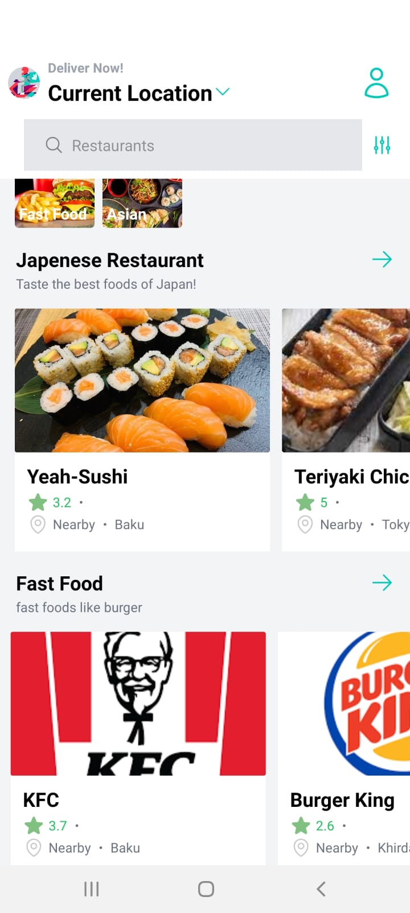
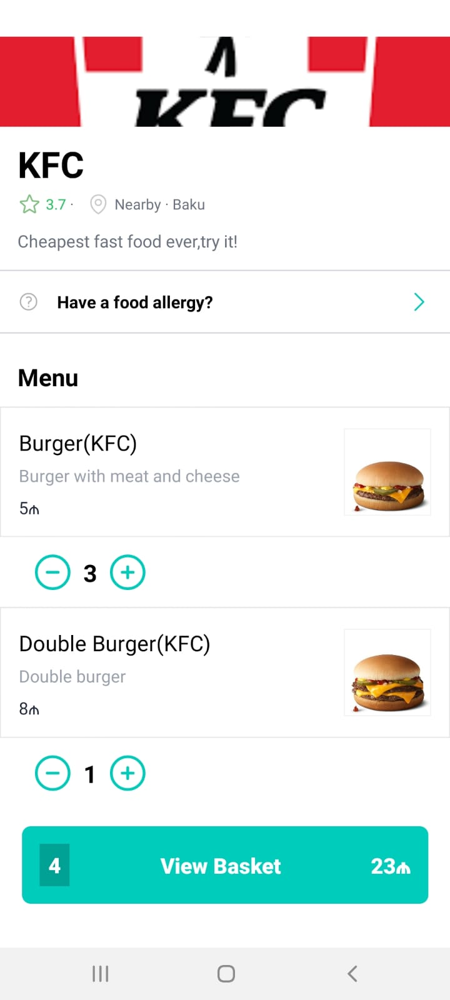
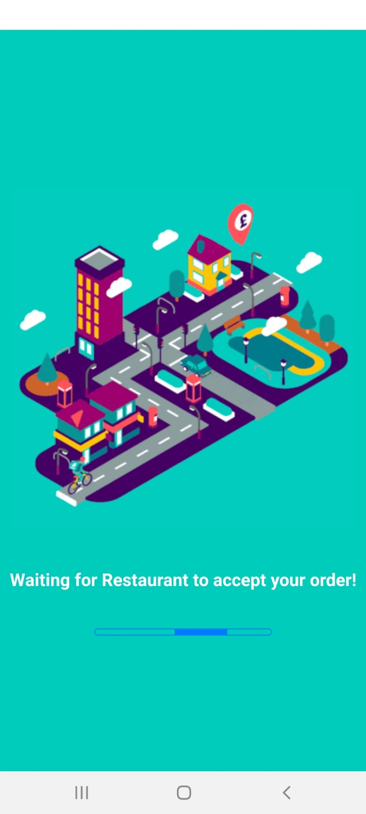
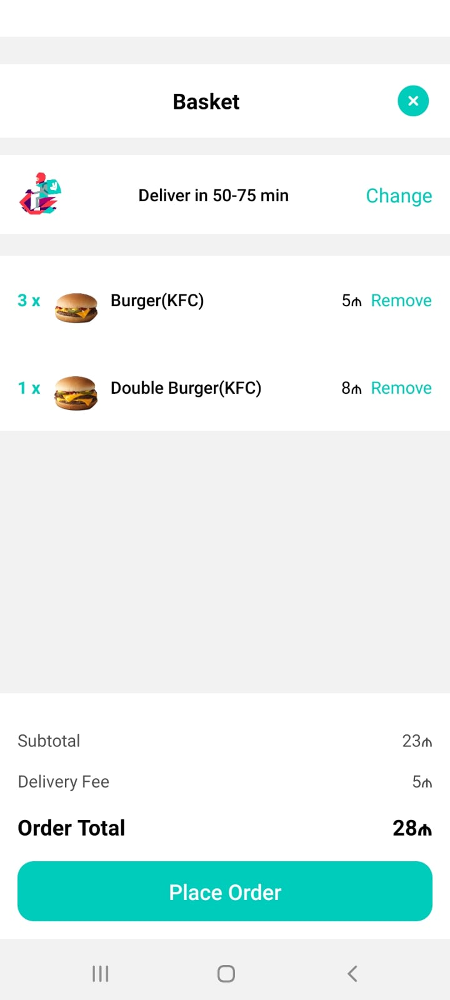
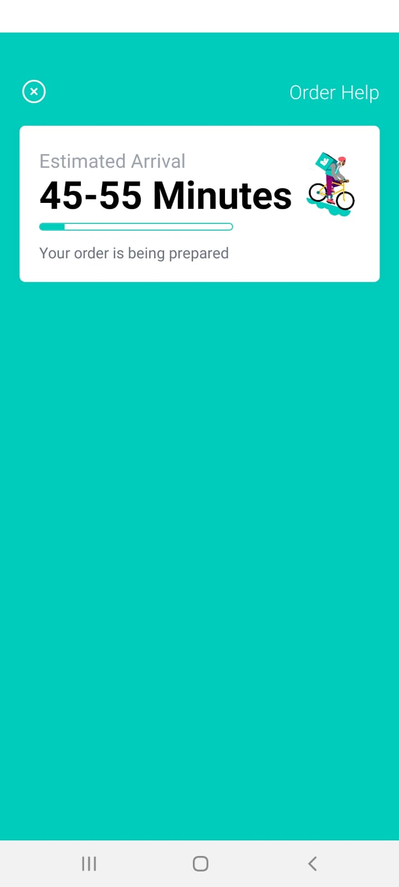
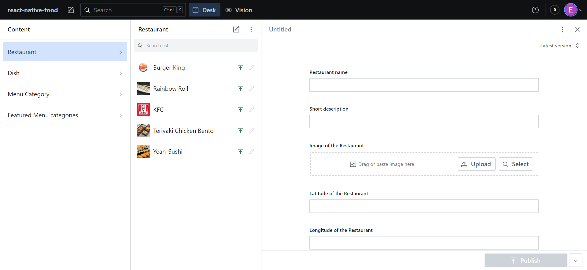

# React-native-food-app

Welcome to food-app! This is a beautifully crafted mobile application built with React Native/Expo and powered by Sanity CMS. In this README, we'll provide you with all the information you need to get started with the app and contribute to its development.


## Table of Contents

- [Getting Started](#getting-started)
  - [Prerequisites](#prerequisites)
  - [Installation](#installation)
- [Usage](#usage)
- [Features](#features)
- [Screenshots](#screenshots)
- [Contributing](#contributing)
- [License](#license)
- [Acknowledgements](#acknowledgements)

## Getting Started

### Prerequisites

Before you begin, ensure you have met the following requirements:

- [Node.js](https://nodejs.org/) and [npm](https://www.npmjs.com/) installed on your machine.
- [Expo CLI](https://docs.expo.dev/get-started/installation/) installed globally.
- A [Sanity CMS](https://www.sanity.io/) account and project set up.

### Installation

1. Clone the repository:

   ```bash
   git clone https://github.com/elmirshidev/react-native-food-app

2. Change into the project directory:
    ```bash
    cd explore-place

3. Create a .env file in the project root and add your Sanity CMS API token/Or just change sanity.js file:
    ```bash
    SANITY_API_TOKEN=your-sanity-api-token


4. Start the Expo development server:
    ```bash
    npm start

5. Follow the Expo CLI instructions to run the app on your preferred platform (iOS/Android simulator or physical device).

Usage
## Usage

Once the app is up and running, you can explore its various features and functionalities. Be sure to check out the stunning user interface and smooth user experience!

## Features

**Key Features:**

- Choosing the restaurant then food
- Desired quantity of food
- App is flexible thanks to Redux Toolkit

**What Makes this FOOD-APP Unique:**

- Unique feature 1
- Unique feature 2

**Integration with Third-Party Services or Libraries:**

- RTK
- react-native-progress
- react-native-animetable
- Sanity cms

## Screenshots


- 
- 
- 
- 
- 
- 


## Contributing

We welcome contributions from the community to make react-native-food app even better. To contribute, follow these steps:

1. Fork the repository on GitHub.
2. Create a new branch with a descriptive name for your feature or bug fix.
3. Make your changes and commit them with meaningful messages.
4. Push your changes to your fork.
5. Create a pull request to the main branch of the original repository.

Please ensure that your pull request adheres to our code of conduct.

## License

No Lisence 😄

## Acknowledgements

- Give credit to any libraries, tools, or resources you used in the project.
- Thank the contributors and users of your app.
- Consider including a section for contact information.

---

Thank you for checking out my food app! I hope you find it as exciting and beautiful as we do. If you have any questions, feedback, or suggestions, please don't hesitate to reach out to me. Happy coding!
